# Mega Man X Retro Experiment Lab

## Project Overview

### Short Description
> **Disclaimer:** Mega Man, Mega Man X, and all related character sprites, artwork, music, sound effects, and associated intellectual properties used from the original games are owned by Capcom Co., Ltd. This is a non-commercial fan game project created for entertainment, learning, and experimentation purposes. No copyright infringement is intended.

This project is a Mega Man X fan game inspired by the SNES version of Mega Man X. The current goal is to recreate the classic gameplay experience while expanding it with additional playable characters from across Capcom franchises, including Mega Man himself, allowing players to experience Mega Man X stages from new perspectives.

As the project is still far from its final vision, content will be released incrementally. Major additions such as new playable characters, stages, and bosses will be delivered through individual updates rather than waiting for a complete release. This approach allows players to experience new content earlier, provide feedback, and helps the project evolve through ongoing balancing and refinement.

If you're interested in the project and use a Windows PC, feel free to download and try the latest available build.

[Download link] (update at 260706)
[https://drive.google.com/file/d/13729NywEdIYpCkBBh5GMk7mypVozXKpL/view?usp=sharing]

Video Demo and SNS link
- Youtube: [https://www.youtube.com/@CrimsonCrazyGuy]
- Reddit: [https://www.reddit.com/user/CrimsonCrazyGuy/submitted/]
- X/Twitter: [https://x.com/CrimsonCrazyGuy]

### Gameplay Screenshots
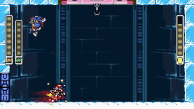

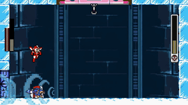

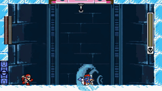

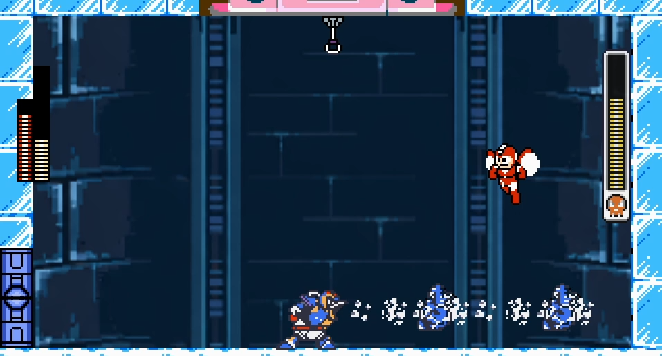

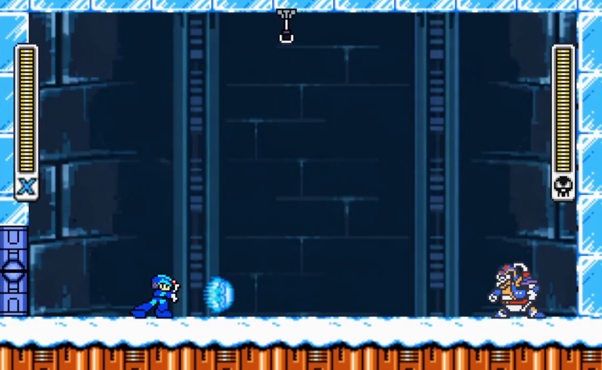

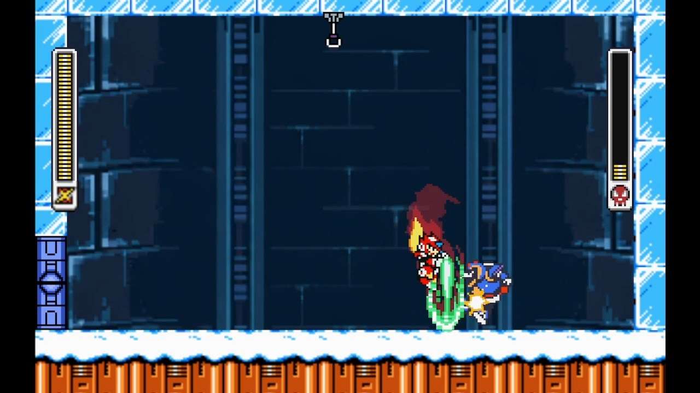

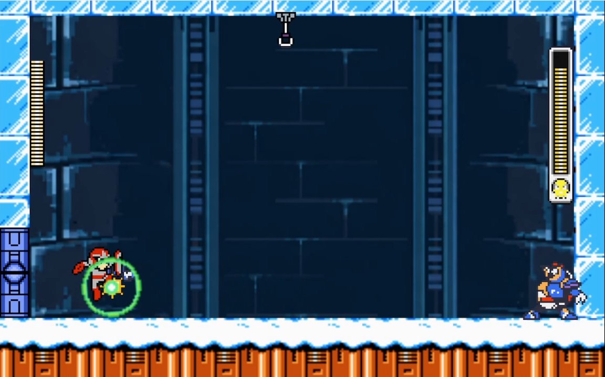

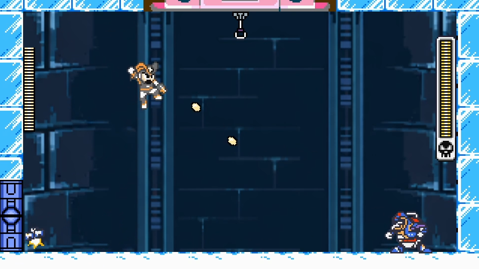

Since the key configuration page is not finished yet, please use the keyboard mapping below for AutoHotKey or play directly with the keyboard:

### Control buttons:
- Dash -> Z
- Jump -> X
- Attack1 -> C
- Attack2 -> V
- Weapon change Left -> A
- Weapon change Right -> D
- Special action1 -> S
- Special action2 -> F
- Up / Down / Left / Right -> Arrow keys

### System

Some mechanics have been intentionally adjusted from the original games. For example, bosses can still take reduced damage during invincibility frames, and some attack like Zero Saber can produce normal damage to Boss in i-frame. Besides, attacks build up impact value that can eventually cause stagger or guard break. And some enemy projectiles or objects which cannot be destroied in original game are breakable with certain attack.

## Playable Characters

### Mega Man
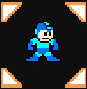

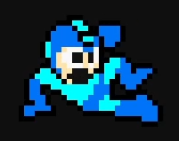
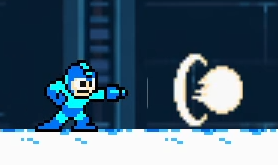
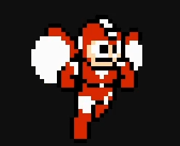
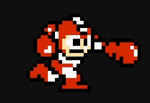

Mega Man, the main character from the original series, faces enemies that are more than ten decades ahead in technology in Mega Man X. That means he has a much harder time against them than before, but his built-in Jet and Power Adapters also give him more options in battle than ever. It all comes down to how the player uses each form's tactics.
Due to lower attack and defense compared to X, this cause a much higher difficulty mainly suited for experienced players.

#### Abilities:

- Sliding: A faithful recreation of the original slide that also reduces his hurtbox.
- Level 2 Mega Buster Charge Shot: Based on the charge shot from Mega Man 5, with higher power.
- Jet Mega Man Adaptor: Based on the Jet Adaptor from Mega Man 6. In addition to flight, it also increases running speed and greatly improves mobility.
- Power Mega Man Adaptor: Based on the Power Adaptor from Mega Man 6. Compared to the original, it deals stronger damage, can destroy special objects and some boss projectiles, and has a higher impact value than the Mega Buster Charge Shot.

#### Special weapons: (WIP)

#### Controls
- Jump -> X
- Sliding (on ground) -> Down + X
- Attack1 (Mega Buster and charge) -> C
- Attack2 (Rapid Mega Buster) -> V
- Special action1 (Jet Adaptor and cancel) -> S
- Special action2 (Power Adaptor and cancel) -> F
- Return to Normal Mega Man -> S+F
- Up / Down / Left / Right -> Arrow keys

### Mega Man X
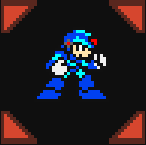

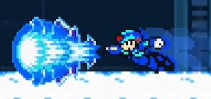
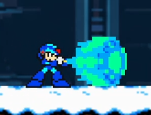
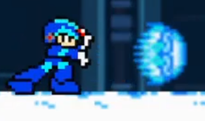

Mega Man X, the main character of the Mega Man X series, is currently built with Mega Man X8 as the temporary development base, so his abilities are a little stronger for now. Once the armor set is finished, some of his functions will be adjusted to be closer to Mega Man X1.

He is intended to be the main playable character and the baseline for game difficulty, so in theory playing as X should provide the lowest difficulty experience.

#### Abilities:

- Dash / Air Dash: A movement action similar to the original games. The Air Dash may later have situational restrictions depending on the final design.
- Wall Kick: A signature move exclusive to X-series characters. This should not need much explanation.
- Level 3 X-Buster Charge Shot: Based on the third charge level from Mega Man X8. Compared to Level 2, it has higher impact value and damage. In the future this may be limited, and once the armor is completed it will at least be replaced by the Spiral Crush Shot.
- Armor: Work in progress. This is a huge amount of work, so please be patient.

#### Special weapons:

- Shotgun Ice (WIP)
- Electric Spark (WIP)
- Rolling Shield (WIP)
- Homing Torpedo (WIP)
- Boomerang Cutter (WIP)
- Chameleon Sting (WIP)
- Storm Tornado (WIP)
- Fire Wave (WIP)

#### Special Attack:

##### Hadouken: A famous Street Fighter finishing move that everyone knows well. In this game it is also an extremely powerful special attack. It will only become a condition-based unlock after the full game is completed, but during the test phase you can use it freely.

##### Shoryuken: WIP. Another well-known Street Fighter finishing move, still under development.

#### Controls
- Dash -> Z
- Air dash (mid-air) -> Z
- Jump -> X
- Attack1 (X Buster and charge)  -> C
- Attack2 (Rapid X Buster) -> V
- Hadouken -> Down, Down Forward, Forward
- Up / Down / Left / Right -> Arrow keys

### Zero
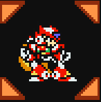

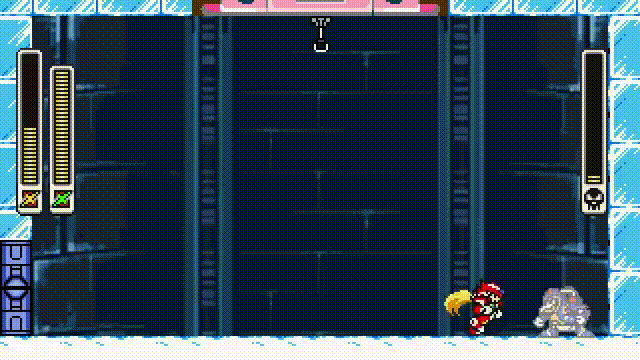

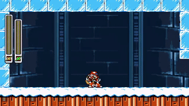
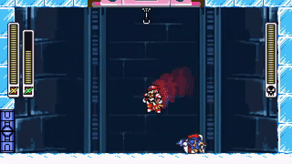
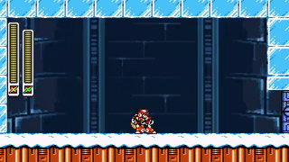
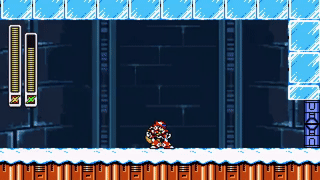

Zero is different from X. His design is primarily based on Mega Man X4, and in addition to the Zero Saber he is planned to have two normal weapons as well, both of which are still in development.

The Zero Saber takes inspiration from the Zero series, with adjusted feel and combo behavior. Against bosses during invincibility frames, most moves can ignore reduced damage and still deal very high damage. Special moves now consume energy, but energy can be restored by landing normal attacks, and it will also recover slowly when he is not attacking. Zero will probably receive the most development effort of all characters, and I hope he can offer an experience that feels different from the original games.

#### Abilities:

- Double Jump
- Air Dash
- Wall Kick
- Zero Saber Combo
- Pulse Chain (WIP)
- Lethal Slasher (WIP)

#### Normal Weapons:

- Zero Saber: His ground normal attacks use Slash 1, 2, and 3, similar to the three-hit sword combo from Mega Man X4. 
In the middle of the combo, he can cancel into Upper Slash or Drop Slash.
These combo routes have weaker impact, but they shorten attack time and allow higher DPS.
The combo options for Upper Slash and Drop Slash can also be swapped into the special moves Ryuenjin and Hyouretsuzan.
Their effects are similar: weaker impact during execution, but faster attack timing and higher DPS.
- Pulse Chain: A mid-range weapon with weaker damage, but it can quickly replenish weapon energy. (WIP)
- Lethal Slasher: A close-range weapon that can be used while moving. (WIP)

#### Special moves (Japanese name will show kanji):

- Hyouretsuzan(冰烈斬): [Z. Saber] An ice-element descending slash that hits once but dealing with high damage.
- Raikousen(雷光閃): [Z. Saber] A lightning-element invincible horizontal dash slash that also supports air dashing. (WIP)
- Ennbuzan(圓舞斬): [Z. Saber] A fast 360-degree spinning slash with projectile-clearing effect. (WIP)
- Reppumai(烈風舞): [L. Slasher] (WIP)
- Shuneishin(瞬影震): [P. Chain] (WIP)
- Roueisyu(朧影襲), Roueimai(朧影舞): [P. Chain] (WIP)
- Reppujin(烈風刃): [L. Slasher] A burst of four-times-speed rapid slashes. One input = four normal attacks. (WIP)
- Ryuuenjin(龍炎刃): [Z. Saber] A fire-element rising slash with multiple hits.
- Earth Crush: [Z. Saber] (WIP)

#### Controls:
- Dash -> Z
- Air dash (mid-air) -> Z
- Jump -> X
- Double Jump (mid-air) -> X
- Attack1 (ZeroSaber) -> C
- ZeroSaberSlash1,2,3 combo (on ground) -> C,C,C
- Upper Slash (on ground) -> Up + C
- Drop Slash (mid-air) -> Down + C
- Attack2 (Special move button)-> V
- Ryuuenjin (on ground) -> Up + V
- Hyouretsuzan (mid-air) -> Down + V
- Up / Down / Left / Right -> Arrow keys

### Proto Man
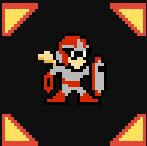

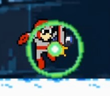
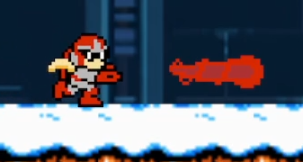

Proto Man follows the Mega Man series concept where his defense is only half of Mega Man's. To compensate for this reduced defense, his Buster is designed so that Charge Shots can be fired directly by spending energy. As long as he has enough energy, he can keep rapid firing. When energy is low, he can use his normal Buster, which only fires two shots once, and restore energy quickly by hitting enemies. Energy also slowly recovers when he is not attacking.

In addition, Proto Shield can be activated while standing or jumping. Making good use of the shield allows him to block most enemy projectiles, greatly improving both survival and strategic depth.

However, not all of his features have been designed yet, and his Special Move is still WIP, so please be patient.

#### Abilities:

- Sliding
- Proto Man Strike
- Proto Buster
- Proto Shield
- Big Bang Strike (WIP)
- Movement Support (WIP)

#### Special weapons: (WIP)

#### Controls
- Jump -> X
- Sliding (on ground) -> Down + X
- Attack1 (Proto Strike) -> C
- Attack2 (Rapid Proto Buster) -> V
- Up / Down / Left / Right -> Arrow keys

### Bass
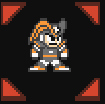

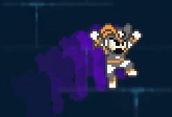
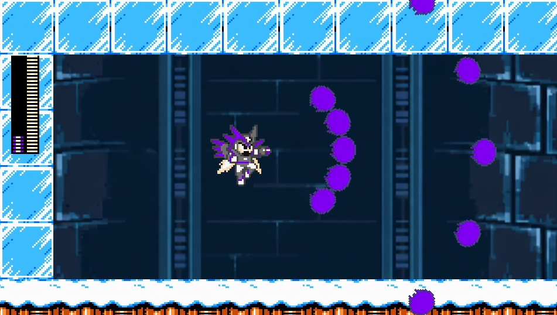

Bass is based on Mega Man & Bass.

His gameplay revolves around Dash Jump and Double Jump mobility, and his Bass Buster is a rapid-fire weapon with lower damage than the Mega Buster, but a much higher firing rate and projectile speed.

Because the Bass Buster deals less damage per shot, it ignores the reduced damage normally caused by boss invincibility frames, allowing Bass to maintain consistent damage output.

When combined with Treble, Bass gains the ability to fly and unleash more powerful attacks. While in this form, he fires a spread of five Bass Buster shots straight ahead. Each shot deals damage independently, allowing Bass to inflict massive damage at close range when multiple shots connect with the same target.

However, attacking consumes even more energy than flying, making energy management a key part of mastering this form. Players must carefully decide whether to spend their limited energy on mobility or firepower.

Energy gradually recovers when not in use, and landing hits with the normal Bass Buster restores additional energy. Effective energy management allows players to maximize the potential of this powerful form.

#### Abilities:

- Dash
- Slide
- Double Jump
- Bass Buster Rapid Shot
- Treble Boost

#### Special weapons: (WIP)

#### Controls
- Dash -> Z
- Jump -> X
- Double Jump (mid-air, can use in dash jump) -> X
- Attack1 (Bass Buster rapid fire)  -> C
- Special action1 (Treble Boost transform and cancel) -> S
- Treble Boost Buster (during Treble Boost) -> C
- Up / Down / Left / Right -> Arrow keys

### Knight Arthur (WIP)
[image]

Knight Arthur is the main character of the Ghosts 'n Goblins series, famous for its brutally punishing difficulty and for challenging players who want to push their limits.

However, his original performance is far too weak. Aside from the armor that absolutely must remain as fragile as ever, the rest of his details are still being adjusted. Please look forward to it.

### Axl (WIP)

### Future feature of other Capcom Characters

#### Resident Evil series (WIP)

#### Street Fighters (WIP)

## Bosses & stages (WIP)

### Chill Penguin
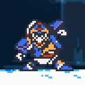

This is the boss with the highest level of completion so far, but some small details are still being adjusted. In the playtest version, you should be able to experience things that feel noticeably different from the original game.
[TODO]

### Spark Mandrill (WIP)
[TODO]

### Armored Armadillo (WIP)
[TODO]

### Launch Octopus (WIP)
[TODO]

### Boomerang Kuwanger (WIP)
[TODO]

### Sting Chameleon (WIP)
[TODO]

### Storm Eagle (WIP)
[TODO]

### Flame Mammoth (WIP)
[TODO]

### Bospider (WIP)
[TODO]

### Rangda Bangda (WIP)
[TODO]

### D-Rex (WIP)
[TODO]

### Velguarder (WIP)
[TODO]

### Sigma (WIP)
[TODO]

## Nes Bosses
Nes character cannot use SNES character's special weapon, so there will be 8 bosses in Original Mega Man series for nes Characters to get their weapon.

### Blizzard Man (WIP)

### Elec Man (WIP)

### WIP

### Dive Man (WIP)

### Cut Man (WIP)

### WIP

### Air Man (WIP)

### WIP

## Development Status

### Current Version
[WIP]

### In Progress
[WIP]

### Planned Features
[TODO]

## Download
[TODO]

## Credits

**Project Creator**

Programming, gameplay design, and the majority of sprite artwork were created by project owner **CrimsonCrazyGuy(Kaiji1315)**.

**Special Thanks**

- **firstjectsnowflakes35**
  - For sharing Godot source code that served as a valuable reference during the implementation of various gameplay systems.
  - https://www.youtube.com/@firstjectsnowflakes35

- **fallensoldier420**
  - Some character sprites used in this project are based on artwork created by fallensoldier420 and are used with the author's permission.
  - https://www.deviantart.com/fallensoldier420

- **mistermike**
  - For preparing and sharing high-quality character sprite resources through The Spriters Resource.
  - https://www.spriters-resource.com/profile/mistermike/
